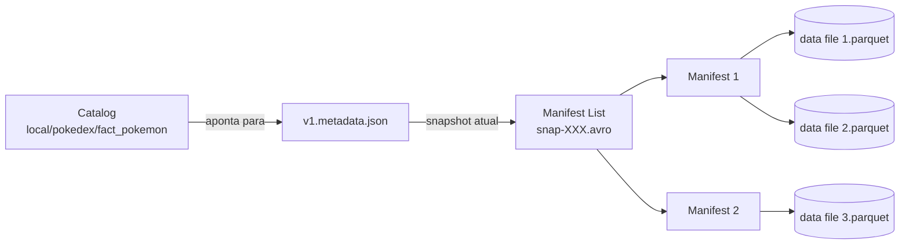

# Apache Iceberg

> **Apache Iceberg** é um *open table format* projetado para **tabelas analíticas gigantes** com suporte a múltiplos engines (Spark, Flink, Trino, Presto, Snowflake, Dremio…). Criado pela **Netflix** em 2017, doado para a Apache Foundation em 2018.

---

## :material-information: Por que Iceberg existe?

O Hive (e Hadoop em geral) tinha problemas conhecidos:

- **Listing de diretórios** para descobrir partições → caro em S3.
- **Sem garantias de atomicidade** entre múltiplos arquivos.
- **Schema/partition evolution** quase impossível sem reescrever tudo.
- **Dependência total** de uma única engine (Hive).

Iceberg resolve cada um:

- **Catálogo** indica o snapshot atual; lista de arquivos vem **da metadata**, não de `ls` no storage.
- Cada commit é um **snapshot atômico**.
- **Schema evolution + partition evolution** são metadados, não reescrita.
- Especificação **aberta e neutra**, com runtimes para várias engines.

---

## :material-database: Anatomia de uma tabela Iceberg

```
local/pokedex/fact_pokemon/
├── metadata/
│   ├── v1.metadata.json         ← versão atual da tabela
│   ├── snap-<id>-1-<uuid>.avro  ← manifest list (snapshot)
│   ├── <uuid>.avro              ← manifest file (lista de arquivos data)
│   └── ...
└── data/
    └── generation_id=1/
        ├── 00000-...parquet
        └── 00001-...parquet
```



**Por que tantas camadas?**

- **Manifest list** lista manifests, com filtros (min/max de partição, contagem de linhas) → planner descarta manifests inteiros antes de abri-los.
- **Manifest** lista data files com estatísticas por coluna (min, max, null_count, value_counts) → *data skipping* fica trivial.

Resultado: queries em tabelas com **milhões de arquivos** continuam rápidas porque o planner navega só na metadata.

---

## :material-cog: Setup da SparkSession

```python
spark = (
    SparkSession.builder.appName("IcebergApp")
    .config("spark.jars.packages",
            "org.apache.iceberg:iceberg-spark-runtime-3.5_2.12:1.6.1")
    .config("spark.sql.extensions",
            "org.apache.iceberg.spark.extensions.IcebergSparkSessionExtensions")
    .config("spark.sql.catalog.local", "org.apache.iceberg.spark.SparkCatalog")
    .config("spark.sql.catalog.local.type", "hadoop")
    .config("spark.sql.catalog.local.warehouse", "/workspace/data/iceberg/warehouse")
    .getOrCreate()
)
```

Pontos importantes:

- **JAR vem do Maven**, não do PyPI. `spark.jars.packages` baixa o `iceberg-spark-runtime-3.5_2.12:1.6.1` no primeiro start (cacheado em `~/.ivy2/`).
- **Catálogo `local`** com tipo `hadoop` — usa o filesystem como catálogo (sem Hive Metastore). Em produção, prefira tipo `hive`, `glue` (AWS) ou `nessie`.
- **`spark.sql.defaultCatalog=local`** permite escrever `pokedex.fact_pokemon` em vez de `local.pokedex.fact_pokemon`.

---

## :material-table-edit: CRUD — exemplos do notebook

Trechos exatos de [`notebooks/02_apache_iceberg.ipynb`](https://github.com/lucascholzeh/spark-lakehouse-project/blob/main/notebooks/02_apache_iceberg.ipynb).

### CREATE TABLE

```sql
CREATE TABLE local.pokedex.fact_pokemon (
    pokemon_id    INT,
    name          STRING,
    type_1_id     INT,
    type_2_id     INT,
    hp INT, attack INT, defense INT,
    sp_atk INT, sp_def INT, speed INT,
    total INT,
    is_legendary  BOOLEAN,
    generation_id INT
) USING iceberg
PARTITIONED BY (generation_id)
```

### INSERT — SQL puro

```sql
INSERT INTO local.pokedex.fact_pokemon VALUES
    (801, 'Decidueye',  17, 8,  78,107,75,100,100,70, 530, false, 7),
    (802, 'Incineroar', 6,  4,  95,115,90,80,90,60,   530, false, 7),
    (803, 'Primarina',  17, 5,  80,74,74,126,116,60,  530, false, 7);
```

Iceberg cria a partição `generation_id=7` automaticamente. O snapshot novo é registrado em `metadata/`.

### UPDATE — SQL

```sql
UPDATE local.pokedex.fact_pokemon
SET attack = attack - 10
WHERE is_legendary = true;
```

### DELETE — SQL

```sql
DELETE FROM local.pokedex.fact_pokemon
WHERE total < 250;
```

### MERGE INTO — Upsert

```sql
MERGE INTO local.pokedex.fact_pokemon t
USING updates_src s
ON t.pokemon_id = s.pokemon_id
WHEN MATCHED THEN UPDATE SET *
WHEN NOT MATCHED THEN INSERT *;
```

Iceberg suporta dois modos de aplicar UPDATE/DELETE/MERGE:

- **Copy-on-Write (CoW)** — padrão: reescreve os data files afetados.
- **Merge-on-Read (MoR)** — escreve *delete files* separados; mais rápido para escrever, mais lento para ler até a próxima compaction.

Configurável por tabela: `'write.update.mode' = 'merge-on-read'`.

---

## :material-format-list-bulleted-square: Schema Evolution

```sql
ALTER TABLE local.pokedex.fact_pokemon
ADD COLUMN mega_evolution BOOLEAN COMMENT 'Possui mega-evolução';
```

Mudança puramente de **metadata** — nenhum arquivo Parquet é tocado. Linhas antigas leem `NULL` na nova coluna automaticamente.

Iceberg mantém um **column ID** estável internamente (não usa o nome). Por isso operações como `RENAME COLUMN` e `DROP COLUMN` são seguras e não corrompem leituras antigas.

---

## :material-shape: Partition Evolution — recurso **exclusivo** do Iceberg

Este é **o** diferencial vs Delta Lake. Você pode mudar o esquema de particionamento de uma tabela existente **sem reescrever os dados antigos**:

```sql
ALTER TABLE local.pokedex.fact_pokemon
ADD PARTITION FIELD is_legendary;
```

Daqui pra frente, novos arquivos serão particionados por `(generation_id, is_legendary)`. **Arquivos antigos continuam intactos**, particionados só por `generation_id`. As queries continuam funcionando porque o Iceberg sabe **qual partition spec** vale para cada arquivo (informação na metadata).

**Casos de uso típicos:**

- Tabela cresceu muito em 2026; agora particionar por mês não basta — adiciona partição por dia.
- Workload mudou; queries agora filtram por uma coluna nova → adiciona-a como partição.

Em Delta Lake, fazer isso exige reescrever a tabela inteira (`OVERWRITE`).

---

## :material-clock-time-eight: Time Travel

```sql
-- Por snapshot ID
SELECT * FROM local.pokedex.fact_pokemon VERSION AS OF 1234567890;

-- Por timestamp
SELECT * FROM local.pokedex.fact_pokemon TIMESTAMP AS OF '2026-04-28 10:00:00';
```

### Metadata tables

Iceberg expõe metadata como **tabelas SQL**, fáceis de consultar:

```sql
-- Todos os snapshots
SELECT * FROM local.pokedex.fact_pokemon.snapshots;

-- History (snapshot atual em cada momento)
SELECT * FROM local.pokedex.fact_pokemon.history;

-- Arquivos de dados
SELECT file_path, partition, record_count, file_size_in_bytes
FROM local.pokedex.fact_pokemon.files;

-- Manifests
SELECT * FROM local.pokedex.fact_pokemon.manifests;

-- Partições
SELECT * FROM local.pokedex.fact_pokemon.partitions;
```

---

## :material-broom: Manutenção

### Compaction

```sql
CALL local.system.rewrite_data_files(
    table => 'pokedex.fact_pokemon',
    options => map('min-input-files', '2', 'target-file-size-bytes', '5242880')
);
```

### Expirar snapshots antigos

```sql
CALL local.system.expire_snapshots(
    table => 'pokedex.fact_pokemon',
    older_than => TIMESTAMP '2026-04-21 00:00:00',
    retain_last => 5
);
```

### Remover arquivos órfãos

```sql
CALL local.system.remove_orphan_files(
    table => 'pokedex.fact_pokemon',
    older_than => TIMESTAMP '2026-04-21 00:00:00'
);
```

---

## :material-thumb-up-outline: Quando escolher Iceberg?

- :material-check: Stack **multi-engine** (Spark + Trino + Flink + …).
- :material-check: Necessidade de **partition evolution**.
- :material-check: Política de **catálogo aberto** e neutralidade de fornecedor.
- :material-check: Tabelas **muito grandes** com muitos arquivos (a metadata escala melhor).
- :material-check: Schema dinâmico (renames, drops frequentes) — graças aos column IDs.

---

## :material-compare: Iceberg × Delta — resumo

| Recurso | Delta Lake | Apache Iceberg |
|---|---|---|
| Origem | Databricks (2019) | Netflix (2017) |
| Metadata | `_delta_log/` (JSON + checkpoint Parquet) | `metadata/` (manifests Avro) |
| API principal | DataFrame + SQL | **SQL puro** + DataFrame |
| Partition evolution | :material-close: | :material-check: |
| Hidden partitioning | :material-close: | :material-check: |
| Multi-engine | Spark forte; outros engines crescendo | :material-check: nativo |
| Compaction | `OPTIMIZE` | `CALL rewrite_data_files` |
| GC | `VACUUM` | `expire_snapshots` + `remove_orphan_files` |

---

## :material-book-open-variant: Referências

- [Documentação Apache Iceberg](https://iceberg.apache.org/docs/latest/)
- [Spark Quickstart](https://iceberg.apache.org/spark-quickstart/)
- [Multi-Engine Support](https://iceberg.apache.org/multi-engine-support/)
- [Iceberg Releases](https://iceberg.apache.org/releases/)
- [Notebook deste projeto: `02_apache_iceberg.ipynb`](https://github.com/lucascholzeh/spark-lakehouse-project/blob/main/notebooks/02_apache_iceberg.ipynb)
