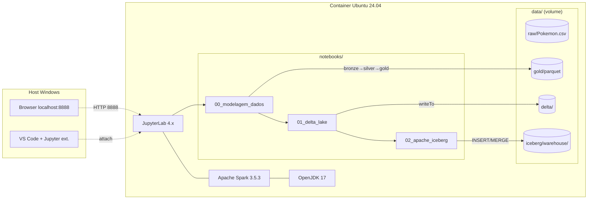
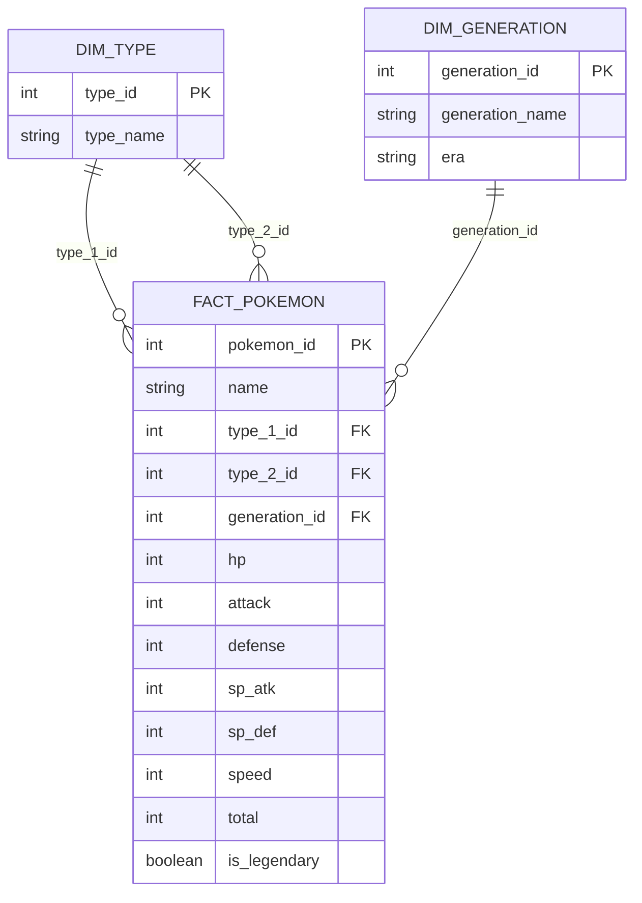

# Spark Lakehouse Project

> Trabalho acadêmico de **Engenharia de Dados** demonstrando a construção de um **Lakehouse** com PySpark, Jupyter, **Delta Lake** e **Apache Iceberg** sobre o dataset Pokémon.

[](https://www.python.org/)
[](https://spark.apache.org/)
[](https://delta.io/)
[](https://iceberg.apache.org/)
[](https://www.docker.com/)
[](https://opensource.org/licenses/MIT)

---

## :octicons-goal-16: Objetivo

Construir um **único ambiente PySpark + Jupyter Lab** rodando em um container **Ubuntu 24.04** que demonstra, na prática, dois dos principais formatos de tabela para Lakehouse:

1. **Delta Lake** — formato criado pela Databricks (2019), open-source desde 2020, com transaction log baseado em JSON.
2. **Apache Iceberg** — formato criado pela Netflix (2017), com metadata em snapshots e suporte multi-engine.

A demonstração é feita sobre um **modelo dimensional (estrela)** derivado do clássico dataset Pokémon (Kaggle), com operações de **CRUD completo** (INSERT, UPDATE, DELETE, MERGE), **schema evolution**, **time travel** e **manutenção** (OPTIMIZE/VACUUM/Compaction).

---

## :material-sitemap: Arquitetura do projeto



---

## :material-database: Fonte de dados

**Dataset**: [Pokemon (Kaggle — abcsds/pokemon)](https://www.kaggle.com/datasets/abcsds/pokemon)

- ~800 Pokémons das gerações 1 a 6
- 13 colunas (atributos de combate, tipos, lendário, geração)
- ~45 KB em CSV (cabe no repo como fallback à prova de balas)
- Mirror público sem login Kaggle: [armgilles/pokemon.csv (Gist)](https://gist.githubusercontent.com/armgilles/194bcff35001e7eb53a2a8b441e8b2c6)

### Modelo dimensional (estrela)

O CSV original é uma única tabela desnormalizada. Para demonstrar JOINs, schema evolution e partition evolution, **normalizamos em modelo estrela** durante a ingestão:



A `fact_pokemon` é **particionada por `generation_id`** (6 partições, ~133 linhas cada).

---

## :material-toolbox: Stack tecnológica

| Componente | Versão | Propósito |
|---|---|---|
| [Ubuntu](https://ubuntu.com/) | 24.04 LTS | Sistema operacional do container |
| [Python](https://www.python.org/) | 3.11 | Linguagem (PySpark 3.5 não suporta 3.12) |
| [OpenJDK](https://openjdk.org/) | 17 | JVM exigida pelo Spark |
| [Apache Spark](https://spark.apache.org/) | 3.5.3 | Engine de processamento |
| [PySpark](https://spark.apache.org/docs/latest/api/python/) | 3.5.3 | API Python do Spark |
| [Delta Lake](https://delta.io/) | 3.2.1 (`delta-spark`) | Table format 1 |
| [Apache Iceberg](https://iceberg.apache.org/) | 1.6.1 | Table format 2 |
| [JupyterLab](https://jupyter.org/) | 4.x | IDE web para os notebooks |
| [MkDocs Material](https://squidfunk.github.io/mkdocs-material/) | 9.5+ | Geração desta documentação |
| [uv](https://docs.astral.sh/uv/) | 0.5+ | Gerenciador de pacotes Python |
| [Docker](https://www.docker.com/) | 24+ | Containerização do ambiente |

---

## :material-package-variant: Por que `uv` e não Poetry?

Avaliamos os dois principais gerenciadores modernos de pacotes Python e escolhemos **uv**. O comparativo:

| Critério | uv | Poetry |
|---|---|---|
| **Velocidade** | :material-rocket-launch: **10–100x mais rápido** (escrito em Rust) | Lento (Python puro) |
| **Gerencia versão Python** | :material-check: Sim (auto-instala) | :material-close: Depende de pyenv |
| **Lockfile** | `uv.lock` (PEP 751) | `poetry.lock` (formato próprio) |
| **PEP compliance** | :material-check: Estrita | Às vezes desvia |
| **Maturidade** | Recente (Astral, mantenedora do Ruff) | Mais antigo, comunidade maior |
| **Publicar lib em PyPI** | OK | :material-star: Mais polido |
| **Build Docker** | :material-check: Cache agressivo | Lento |

!!! tip "Recomendação"
    Para uma **aplicação data engineering em Docker**, `uv` ganha em velocidade e simplicidade. Poetry seria escolha melhor se o projeto fosse uma biblioteca a ser publicada no PyPI.

---

## :material-docker: Por que Docker Ubuntu e não WSL diretamente?

**Reprodutibilidade** é o nome do jogo. Numa apresentação acadêmica de 10 minutos, qualquer "no meu computador funciona" custa nota.

| Critério | Docker | WSL direto |
|---|---|---|
| Reprodutível em qualquer host | :material-check: | :material-close: |
| Estado limpo a cada reset | :material-check: | :material-close: |
| Imutabilidade do ambiente | :material-check: | :material-close: |
| Portável para CI/CD | :material-check: | :material-close: |
| Setup leve (sem VM) | :material-check: (WSL2 backend) | :material-check: |

O `docker-compose.yml` deste projeto é a **única dependência** que o avaliador precisa para reproduzir tudo.

---

## :material-rocket-launch: Como reproduzir

```bash
# 1. Clonar
git clone https://github.com/lucascholzeh/spark-lakehouse-project.git
cd spark-lakehouse-project

# 2. (Opcional — já vem commitado) Baixar Pokemon.csv
bash scripts/setup_data.sh

# 3. Subir o ambiente
docker compose up --build -d

# 4. Abrir o JupyterLab
# http://localhost:8888
```

Detalhes completos no [README do repositório](https://github.com/lucascholzeh/spark-lakehouse-project#readme).

---

## :material-format-list-numbered: Roteiro de leitura

1. [**Apache Spark / PySpark**](pyspark.md) — fundamentos do engine que processa tudo.
2. [**Delta Lake**](delta-lake.md) — exemplos de INSERT, UPDATE, DELETE com transaction log.
3. [**Apache Iceberg**](iceberg.md) — mesmas operações + partition evolution exclusiva.

---

## :material-robot: Uso de IA

Esta documentação e o código foram desenvolvidos com auxílio de **IA generativa (Claude — Anthropic)** em conformidade com o requisito do enunciado:

- Pesquisa da **matriz de compatibilidade** entre Spark 3.5, Delta 3.2.1 e Iceberg 1.6.1.
- Comparativo benchmarkado entre **uv vs Poetry** (2026).
- Estruturação do **Dockerfile multi-stage** com cache de layers e do `docker-compose.yml`.
- Geração dos **notebooks didáticos** (CRUD + time travel) e dos **diagramas Mermaid**.
- Redação inicial das páginas MkDocs (revisadas e adaptadas pelo autor).

---

## :material-account: Autoria

**Lucas Hoffmann, Victor Casagrande e Davi Novakoski**

- Trabalho acadêmico — Engenharia de Dados
- Repositório: [github.com/lucascholzeh/spark-lakehouse-project](https://github.com/lucascholzeh/spark-lakehouse-project)
