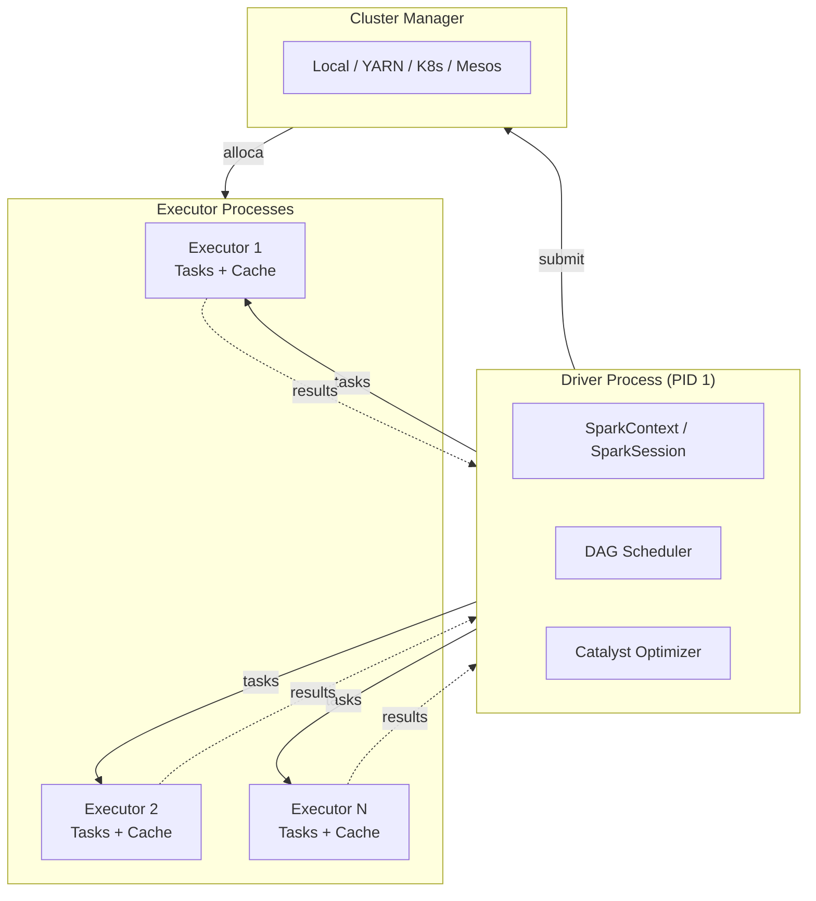

# Apache Spark / PySpark

> **Apache Spark** é um motor unificado de processamento distribuído para *big data*, com APIs em Java, Scala, Python (**PySpark**), R e SQL. Neste projeto, ele é o engine que escreve e lê tabelas Delta e Iceberg.

---

## :material-information: O que é o Spark?

Spark surgiu em 2009 na **UC Berkeley AMPLab** como sucessor do Hadoop MapReduce. Em vez de escrever resultados intermediários em disco a cada passo, o Spark mantém dados na **memória entre estágios**, o que torna pipelines iterativos (ML, agregações multi-step) **10–100× mais rápidos** que MapReduce.

Hoje (2026) é um projeto top-level da Apache Foundation, com **5 módulos principais**:

| Módulo | O que faz |
|---|---|
| **Spark Core** | RDDs, scheduler, gerenciamento de cluster |
| **Spark SQL** | DataFrames, Catalyst optimizer, conectores (Parquet, ORC, JDBC, Iceberg, Delta) |
| **Structured Streaming** | Streaming de dados com a mesma API do Spark SQL |
| **MLlib** | Algoritmos de Machine Learning distribuídos |
| **GraphX** | Processamento de grafos (Scala) |

Neste projeto usamos basicamente **Spark SQL + DataFrames**.

---

## :material-language-python: Por que PySpark?

**PySpark** é o binding oficial em Python. Ele atende dois públicos:

- **Cientistas/engenheiros de dados** que já vivem no ecossistema Python (pandas, numpy, sklearn).
- **SQL-lovers** que usam apenas `spark.sql(...)` sem nem perceber que estão em Python.

Trade-off conhecido: chamadas **UDF Python puras** sofrem com serialização Python ↔ JVM. Por isso preferimos sempre **funções nativas** (`pyspark.sql.functions`) ou **Pandas UDFs** (vetorizadas via Arrow).

---

## :material-graph: Arquitetura



**Neste projeto rodamos em modo `local[*]`** dentro de um único container — sem cluster manager externo. O driver e o executor são o mesmo processo. Para um trabalho acadêmico isso é mais que suficiente; para produção, troca-se `local[*]` por YARN / Kubernetes.

---

## :material-cog: Conceitos-chave

### DataFrame

Tabela distribuída com schema (similar a `pandas.DataFrame`, mas particionada e *lazy*).

```python
df = spark.read.option("header", True).csv("/workspace/data/raw/Pokemon.csv")
df.printSchema()
df.show(5)
```

### Lazy evaluation

Transformações (`select`, `filter`, `join`) **não executam imediatamente** — apenas constroem um plano lógico. A execução só acontece quando uma **ação** (`show`, `count`, `collect`, `write`) é chamada.

```python
# Nenhuma computação ainda
filtered = df.filter("Generation = 1").select("Name", "Type 1")

# AGORA executa o pipeline inteiro
filtered.show()
```

### Catalyst Optimizer

O Spark SQL otimiza o plano antes de executar:

1. **Plano lógico** — análise sintática da query.
2. **Otimização lógica** — predicate pushdown, column pruning, constant folding.
3. **Planos físicos** — gera várias alternativas, escolhe a de menor custo.
4. **Geração de código** — Whole-Stage CodeGen produz Java bytecode.

```python
# Ver o plano otimizado
filtered.explain(True)
```

---

## :material-rocket: SparkSession — ponto de entrada

```python
from pyspark.sql import SparkSession

spark = (
    SparkSession.builder
    .appName("MeuApp")
    .config("spark.sql.session.timeZone", "UTC")
    .getOrCreate()
)
```

### Configuração para Delta Lake

```python
from delta import configure_spark_with_delta_pip

builder = (
    SparkSession.builder.appName("DeltaApp")
    .config("spark.sql.extensions",
            "io.delta.sql.DeltaSparkSessionExtension")
    .config("spark.sql.catalog.spark_catalog",
            "org.apache.spark.sql.delta.catalog.DeltaCatalog")
)
spark = configure_spark_with_delta_pip(builder).getOrCreate()
```

### Configuração para Apache Iceberg

```python
spark = (
    SparkSession.builder.appName("IcebergApp")
    .config("spark.jars.packages",
            "org.apache.iceberg:iceberg-spark-runtime-3.5_2.12:1.6.1")
    .config("spark.sql.extensions",
            "org.apache.iceberg.spark.extensions.IcebergSparkSessionExtensions")
    .config("spark.sql.catalog.local", "org.apache.iceberg.spark.SparkCatalog")
    .config("spark.sql.catalog.local.type", "hadoop")
    .config("spark.sql.catalog.local.warehouse", "/workspace/data/iceberg/warehouse")
    .getOrCreate()
)
```

---

## :material-code-tags: APIs principais usadas no projeto

### Leitura

```python
# CSV
df = spark.read.option("header", True).option("inferSchema", True).csv(path)

# Parquet
df = spark.read.parquet(path)

# Delta
df = spark.read.format("delta").load(path)

# Iceberg (via catálogo)
df = spark.table("local.pokedex.fact_pokemon")
```

### Transformações

```python
from pyspark.sql import functions as F

silver = (
    bronze
    .withColumnRenamed("Type 1", "type_1")
    .withColumn("type_2",
                F.when(F.col("type_2") == "", None).otherwise(F.col("type_2")))
    .withColumn("is_legendary", F.col("Legendary").cast("boolean"))
)
```

### Window functions

```python
from pyspark.sql.window import Window

dim_type = (
    types.distinct().orderBy("type_name")
    .withColumn("type_id", F.row_number().over(Window.orderBy("type_name")))
)
```

### Escrita

```python
# Particionado por generation_id
(fact_pokemon.write
    .format("delta")
    .mode("overwrite")
    .partitionBy("generation_id")
    .save("/workspace/data/delta/fact_pokemon"))
```

### SQL

```python
spark.sql("SELECT generation_id, COUNT(*) FROM local.pokedex.fact_pokemon GROUP BY 1").show()
```

---

## :material-tools: Boas práticas aplicadas neste projeto

!!! tip "Particionar por colunas de baixa cardinalidade"
    `fact_pokemon` é particionada por `generation_id` (6 valores). Particionar por algo de alta cardinalidade (ex: `pokemon_id`) destruiria a performance.

!!! tip "Coalesce antes de escrever pequenos datasets"
    `dim_type` tem ~18 linhas. `coalesce(1)` antes de escrever evita gerar 200 arquivos minúsculos.

!!! tip "Usar funções nativas em vez de UDFs Python"
    Toda lógica de limpeza no notebook 00 usa `pyspark.sql.functions` — não `udf()`. Isso mantém a execução **dentro da JVM** (sem serialização Python).

!!! tip "Habilitar `mergeSchema` apenas onde necessário"
    No notebook Delta, `spark.databricks.delta.schema.autoMerge.enabled=true` é setado **na sessão** para a demo. Em produção, prefira passar `option("mergeSchema", "true")` apenas no write específico.

---

## :material-book-open-variant: Referências

- [Documentação oficial do Apache Spark 3.5](https://spark.apache.org/docs/3.5.3/)
- [PySpark API Reference](https://spark.apache.org/docs/3.5.3/api/python/)
- [Spark SQL — Catalyst Optimizer](https://spark.apache.org/docs/3.5.3/sql-ref-functions.html)
- [Configuração de SparkSession](https://spark.apache.org/docs/3.5.3/configuration.html)
